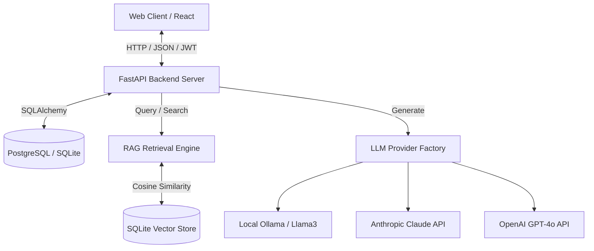

# System Architecture - Lenny Growth Assistant

The application is structured as a decoupled full-stack architecture.

## 1. Frontend
- React 18+ bootstrapped with Vite.
- Navigation routed via `react-router-dom`.
- Styling built on Tailwind CSS (v4) for responsive layouts.
- Authentication managed with Context APIs and Axios interceptors for JWT injection.
- Artifacts rendered in a split screen containing an iframe to execute HTML/CSS in isolation.

## 2. Backend
- FastAPI server using dependencies for database sessions and JWT validation.
- SQLite vector database utilizing numpy-like pure python Cosine Similarity on deterministic/Ollama vectors.
- Service layer separating message persistence, artifact storage, and authentication.

## 3. LLM Abstraction
- Unified `LLMProvider` interface which maps HTTP timeouts and errors into app-level exceptions.
- Router layer determining the appropriate execution skill (`qa`, `essay`, `artifact`) using LLM prompt classification.
